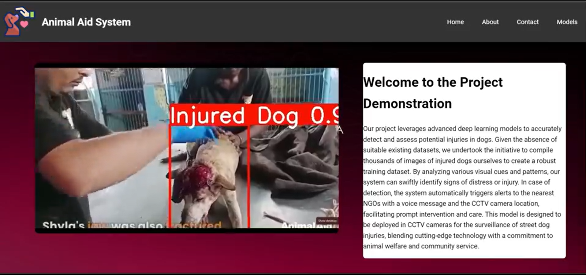
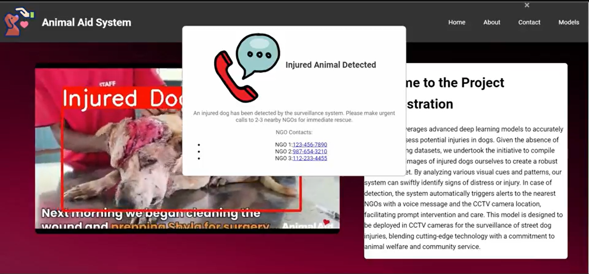
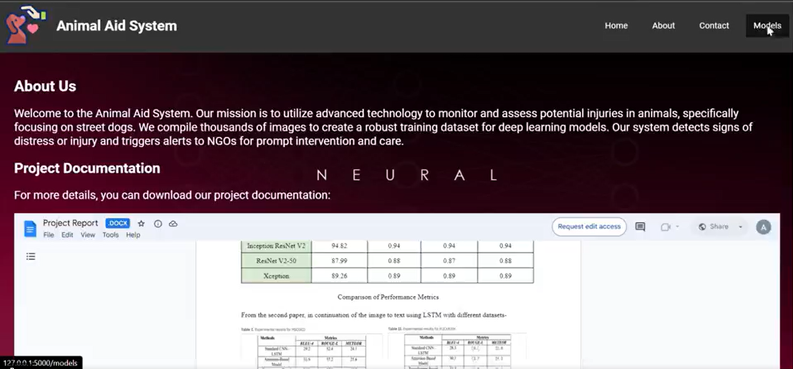

# Animal Aid System

<div align="center">
    
    
    
</div>
## Overview

The **Animal Aid System** is an innovative project aimed at rescuing injured dogs using deep learning and CCTV technology. The system detects injured dogs in real-time and sends alerts to nearby NGOs to ensure prompt rescue.

## Features

- **Real-Time Detection:** Uses a deep learning model to identify injured dogs from live CCTV footage.
- **Instant Alerts:** Automatically notifies the nearest NGOs when an injured dog is detected.
- **Seamless Integration:** Compatible with existing CCTV systems for easy deployment.

## How It Works

1. **CCTV Integration:** Connect the system to your CCTV cameras.
2. **Deep Learning Model:** The model processes the video feed to detect injured dogs.
   - **Custom Dataset:** The model is trained on a custom dataset of approximately 2,300 images of injured dogs, created by the project team. This dataset is unique as it is not available on the internet but may be published in the future.
3. **Alert System:** Once an injured dog is detected, an alert is sent to the nearest NGO.


## Installation & Setup

1. **Clone the Repository:**
   ```bash
   git clone https://github.com/Akash-9070/animal-aid-system.git

